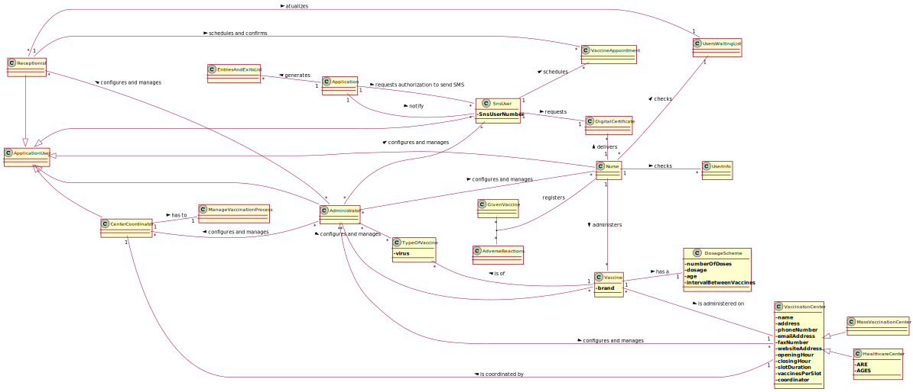

# OO Analysis #

The construction process of the domain model is based on the client specifications, especially the nouns (for _concepts_) and verbs (for _relations_) used. 

## Rationale to identify domain conceptual classes ##
To identify domain conceptual classes, start by making a list of candidate conceptual classes inspired by the list of categories suggested in the book "Applying UML and Patterns: An Introduction to Object-Oriented Analysis and Design and Iterative Development". 

### _Conceptual Class Category List_ ###

**Business Transactions**

*

---

**Transaction Line Items**

*

---

**Product/Service related to a Transaction or Transaction Line Item**

*  Vaccination

---

**Transaction Records**

*  

---  

**Roles of People or Organizations**

* Administrator, Nurse, Receptionist, User, Center Coordinator

---

**Places**

*  Vaccination Center

---

**Noteworthy Events**

* 

---

**Physical Objects**

* 

---

**Descriptions of Things**

*  

---

**Catalogs**

*  

---

**Containers**

*  

---

**Elements of Containers**

*  

---

**Organizations**

* SNS, DGS

---

**Other External/Collaborating Systems**

*  

---

**Records of finance, work, contracts, legal matters**

* 

---

**Financial Instruments**

*  

---

**Documents mentioned/used to perform some work/**

* Reports, Vaccination History, Vaccination Certificate
---

###**Rationale to identify associations between conceptual classes**###

An association is a relationship between instances of objects that indicates a relevant connection and that is worth of remembering, or it is derivable from the List of Common Associations: 

+ **_A_** is physically or logically part of **_B_**
+ **_A_** is physically or logically contained in/on **_B_**
+ **_A_** is a description for **_B_**
+ **_A_** known/logged/recorded/reported/captured in **_B_**
+ **_Administrator_** uses or manages or owns **_Vaccines_**
+ **_Administrator_** uses or manages or owns **_Vaccine Type_**
+ **_Administrator_** uses or manages or owns **_Vaccination Center_**
+ **_Administrator_** uses or manages or owns **_Employees_**
+ **_Administrator_** uses or manages or owns **_Center Coordinators_**
+ **_Administrator_** uses or manages or owns **_SNS Users_**
+ **_Administrator_** uses or manages or owns **_Receptionists_**
+ **_Administrator_** uses or manages or owns **_Nurses_**
+ **_A_** is related with a transaction (item) of **_B_**
+ etc.

| Concept (A) 		|  Association   	|  Concept (B) |
|----------	   		|:-------------:		|------:       |
| C1  	| verb1    		 	| C2  |
| Administrator  	| manages    		 	| Vaccines  |
| Administrator  	| manages    		 	| Vaccine Type  |
| Administrator  	| manages    		 	| Vaccination Center  |
| Administrator  	| manages    		 	| Employees  |
| Administrator  	| manages    		 	| Center Coordinators  |
| Administrator  	| manages    		 	| SNS Users  |
| Administrator  	| manages    		 	| Receptionists  |
| Administrator  	| manages    		 	| Nurses  |

## Domain Model

**Do NOT forget to identify concepts atributes too.**

**Insert below the Domain Model Diagram in a SVG format**

