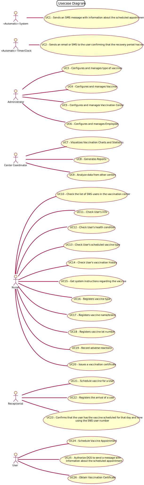

# Use Case Diagram (UCD)

**In the scope of this project, there is a direct relationship of _1 to 1_ between Use Cases (UC) and User Stories (US).**

However, be aware, this is a pedagogical simplification. On further projects and curricular units might also exist _1 to N **and/or** N to 1 relationships between US and UC.
    

**For each UC/US, it must be provided evidences of applying main activities of the software development process (requirements, analysis, design, tests and code). Gather those evidences on a separate file for each UC/US and set up a link as suggested below.**

# Use Cases / User Stories

## Administrator
| UC/US  | Description                                |                   
|:-------|:-------------------------------------------|
| US 001 | Configure and Manage types of Vaccines     |
| US 002 | Configure and Manage Vaccines              |
| US 003 | Configure and Manage Vaccination Centres   |
| US 004 | Configure and Manage Employees             |
| US 005 | Register Centres               |
| US 006 | Register Centres Coordinators  |
| US 007 | Register SNS Users             |
| US 008 | Register Receptionists         |
| US 009 | Register Nurses                |

## Centre Coordinator
| UC/US  | Description                       |                   
|:-------|:----------------------------------|
| US 010 | Visualize Vaccination Statistics  |
| US 011 | Analyse and Comparison            |

## Nurse

| UC/US  | Description                                   |                   
|:-------|:----------------------------------------------|
| US 012 | Check the Presence of the Patient             |
| US 013 | Check Health Conditions                       |
| US 014 | Checks Scheduled Vaccine Type                 |
| US 015 | Checks SNS user Vaccination History           |
| US 016 | Check User Info                               |
| US 017 | Register Vaccine Type                         |
| US 018 | Register Vaccine name/brand                   |
| US 019 | Register Vaccine lot number                   |
| US 020 | Issue Vaccination Certificate                 |
| US 021 | Deliver Vaccination Certificate               |
| US 022 | Record Adverse Reactions                      |
| US 023 | Get System Instructions Regarding the Vaccine |

## Receptionist
| UC/US  | Description           |                   
|:-------|:----------------------|
| US 024 | Schedule Vaccine For a User                   |
| US 025 | Presence Confirmation |
| US 026 | Arrivals Registration |

## User
| UC/US  | Description                |                   
|:-------|:---------------------------|
| US 027 | Vaccine Scheduling         |
| US 028 | Authorize SMS message      | 
| US 029 | Obtain Digital Certificate |

## System
|

