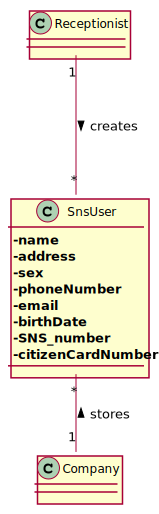

# US 03 - To register a SNS user

## 1. Requirements Engineering

### 1.1. User Story Description

As a receptionist, I want to register an SNS user.

### 1.2. Customer Specifications and Clarifications 

No specifications nor clarifications were given.

### 1.3. Acceptance Criteria

The SNS user must become a system user.

### 1.4. Found out Dependencies

No dependencies were found.

### 1.5 Input and Output Data

**Input Data:**

* Typed data:
	* a name, 
	* a email, 
	* a password
	

**Output Data:**

* (In)Success of the operation

### 1.6. System Sequence Diagram (SSD)

### 1.7 Other Relevant Remarks

No other relevant remarks.

## 2. OO Analysis

### 2.1. Relevant Domain Model Excerpt 

### 2.2. Other Remarks

No other relevant remarks.

## 3. Design - User Story Realization 

### 3.1. Rationale

| Interaction ID | Which class responsible for...           | Answer               | Justification                                                                                                 |
|:---------------|:-----------------------------------------|:---------------------|:--------------------------------------------------------------------------------------------------------------|
| Step 1         | ...interacting with the actor?           | CreateUserUI         | Pure Fabrication: there is no reason to assign this responsibility to any existing class in the Domain Model. |
|                | ...coordinating the US                   | CreateUserController | **Controller**                                                                                                |
| Step 2         | ...instantiating a new User              | Company              | **Creator**                                                                                                   |
| Step 3         | ...saving the inputted data for the User | VaccineType          | IE: An Administrator configures and manages the data                                                          |
| Step 4         | ...informing operation success           | CreateUserUI         | IE: is responsible for user interactions                                                                      |

 
### Systematization ##

According to the taken rationale, the conceptual classes promoted to software classes are: 

* Administrator → Company

Other software classes (i.e. Pure Fabrication) identified: 

 * CreateUserUI  
 * CreateUserController
 * VaccineType
 * CreateUserUI

## 3.2. Sequence Diagram (SD)

## 3.3. Class Diagram (CD)

