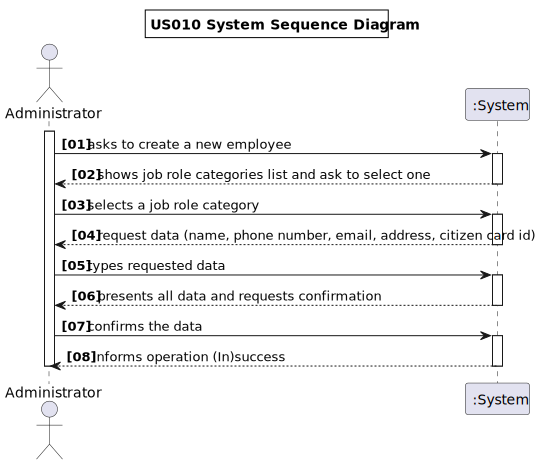
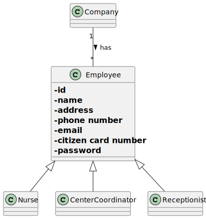

# US 010 - Register a new Employee.

## 1. Requirements Engineering

### 1.1. User Story Description

As an administrator, I want to register an employee.

### 1.2. Customer Specifications and Clarifications

**From the specifications document**

> Any DGS administrator uses the application to register centre coordinators, recepcionists and nurses enrolled in the
> vaccination process.

> All those who wish to use the application must be authenticated with a password holding seven alphanumeric characters,
> including three capital letters and two digits.

### 1.3. Acceptance Criteria

* **AC1:** Each user must have a single role defined in the system.
* **AC2:** The "auth" component available on the repository must be reused (without modifications).

### 1.4. Found out Dependencies

No dependecies were found, as this user storie does not depend on from any other US.

### 1.5 Input and Output Data

**Input Data**

* Typed Data:
* A name,
* A job title,
* An email,
* A password,
* An address,
* phone number,
* Citizen Card Number,

**Output Data**

* List of existing job titles,
* (In)Success of the operation,

### 1.6. System Sequence Diagram (SSD)

### 1.7 Other Relevant Remarks

**No information given was relevant to fulfill this field**

## 2. OO Analysis

### 2.1. Relevant Domain Model Excerpt

### 2.2. Other Remarks

**No additional remarks were found**

## 3. Design - User Story Realization

### 3.1. Rationale

**The rationale grounds on the SSD interactions and the identified input/output data.**

| Interaction ID | Question: Which class is responsible for...         | Answer                        | Justification (with patterns)                                                                                 |
|:---------------|:----------------------------------------------------|:------------------------------|:--------------------------------------------------------------------------------------------------------------|
| Step 1         | ... interacting with the actor?                     | RegisterNewEmployeeUI         | Pure Fabrication: there is no reason to assign this responsibility to any existing class in the Domain Model. |
|                | ... coordinating the US?                            | RegisterNewEmployeeController | Controller                                                                                                    |
| Step 2         | 							                                             |                               |                                                                                                               |
| Step 3         | 	...saving the inputted data?						                 | Company                       | IE: object created in step 1 has its own data.                                                                |
| Step 4         | 	...knowing the job roles to show?						            | Employee                      | IE: Task Categories are defined by the Employee.                                                              |
| Step 5         | ... saving the selected category?							            | Company                       | IE: object created in step 1 is classified in one Category.                                                   |              
| Step 6         | 							                                             |                               |                                                                                                               |
| Step 7         | ... validating all data (local validation)? 							 | Employee                      | IE: owns its data.                                                                                            |
|                | ... validating all data (global validation)?        | Company                       | IE: knows all its employees.                                                                                  |
|                | ... saving the created employee?	 						            | Company                       | IE: owns all its tasks.                                                                                       |
| Step 8         | ... informing operation success? 							            | RegisterNewEmployeeUI         | IE: is responsible for user interactions.                                                                     |  

### Systematization ##

According to the taken rationale, the conceptual classes promoted to software classes are:

* Class1
* Class2
* Class3

Other software classes (i.e. Pure Fabrication) identified:

* xxxxUI
* xxxxController

## 3.2. Sequence Diagram (SD)

*In this section, it is suggested to present an UML dynamic view stating the sequence of domain related software
objects' interactions that allows to fulfill the requirement.*

## 3.3. Class Diagram (CD)

*In this section, it is suggested to present an UML static view representing the main domain related software classes
that are involved in fulfilling the requirement as well as and their relations, attributes and methods.*

# 4. Tests

*In this section, it is suggested to systematize how the tests were designed to allow a correct measurement of
requirements fulfilling.*

**_DO NOT COPY ALL DEVELOPED TESTS HERE_**

**Test 1:** Check that it is not possible to create an instance of the Example class with null values.

	@Test(expected = IllegalArgumentException.class)
		public void ensureNullIsNotAllowed() {
		Exemplo instance = new Exemplo(null, null);
	}

*It is also recommended to organize this content by subsections.*

# 5. Construction (Implementation)

*In this section, it is suggested to provide, if necessary, some evidence that the construction/implementation is in
accordance with the previously carried out design. Furthermore, it is recommeded to mention/describe the existence of
other relevant (e.g. configuration) files and highlight relevant commits.*

*It is also recommended to organize this content by subsections.*

# 6. Integration and Demo

*In this section, it is suggested to describe the efforts made to integrate this functionality with the other features
of the system.*

# 7. Observations

*In this section, it is suggested to present a critical perspective on the developed work, pointing, for example, to
other alternatives and or future related work.*

