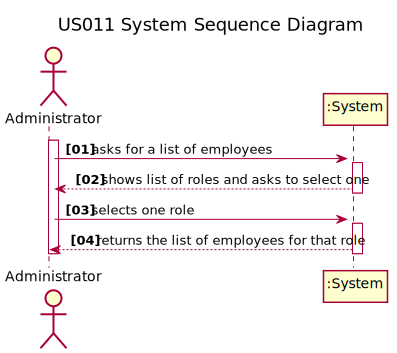
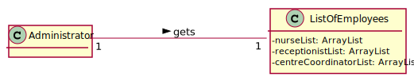

# US 011 - Get a list of Employees with a given function/role.

## 1. Requirements Engineering

### 1.1. User Story Description

As an **Administrator**, I want to get a list of **Employees** with a given function/role.

### 1.2. Customer Specifications and Clarifications 

**From the specifications document:**

> No information about an administrator getting a list of Employees with a given role in the document.

**From the client clarifications:**

> No questions about this subject yet.
 

> **Question:** The list of employees to be got by the admin is per vaccination centre, isn't it?

> **Answer:** 
 
> **Question** Should the administrator type the role he wants to see the list or select it from a list of existing  roles?

> **Answer**

> **Question** Is there any requirement or input that the Administrator must insert to get the list of the employees?
 
> **Answer**

> **Question** What are the criteria that those employees need to meet to appear on that list?
 
> **Answer**
 
 
> **Question** Does the list of employees have any relevance on the functionality of the application?
 
> **Answer**
 
 
> **Question** Should we assume SNSUsers must also appear on that list?
 
> **Answer**

> **Question** Should we give the user the possibility of listing employees from more than 1 role?
 
> **Answer**
 
 
> **Question** Should the list be sorted in any specific way (for example alphabetical name order) or should we give the option to sort by other characteristics?
 
> **Answer**
 

### 1.3. Acceptance Criteria

> No acceptance criteria yet.

### 1.4. Found out Dependencies

> No dependencies were found.

### 1.5 Input and Output Data

**Input Data:**

* A function/role;

**Output Data:**

* A list of employees with the selected function/role.

### 1.6. System Sequence Diagram (SSD)

### 1.7 Other Relevant Remarks

*There aren't any other relevant remarks.*

## 2. OO Analysis

### 2.1. Relevant Domain Model Excerpt 

*In this section, it is suggested to present an excerpt of the domain model that is seen as relevant to fulfill this requirement.* 

### 2.2. Other Remarks

*There aren't any other relevant remarks.* 

## 3. Design - User Story Realization 

### 3.1. Rationale

**The rationale grounds on the SSD interactions and the identified input/output data.**

| Interaction ID | Question: Which class is responsible for... | Answer  | Justification (with patterns)  |
|:-------------  |:--------------------- |:------------|:---------------------------- |
| Step 1  		 |							 |             |                              |
| Step 2  		 |							 |             |                              |
| Step 3  		 |							 |             |                              |
| Step 4  		 |							 |             |                              |
| Step 5  		 |							 |             |                              |
| Step 6  		 |							 |             |                              |              
| Step 7  		 |							 |             |                              |
| Step 8  		 |							 |             |                              |
| Step 9  		 |							 |             |                              |
| Step 10  		 |							 |             |                              |  

### Systematization ##

According to the taken rationale, the conceptual classes promoted to software classes are: 

 * Class1
 * Class2
 * Class3

Other software classes (i.e. Pure Fabrication) identified: 
 * xxxxUI  
 * xxxxController

## 3.2. Sequence Diagram (SD)

*In this section, it is suggested to present an UML dynamic view stating the sequence of domain related software objects' interactions that allows to fulfill the requirement.* 

## 3.3. Class Diagram (CD)

*In this section, it is suggested to present an UML static view representing the main domain related software classes that are involved in fulfilling the requirement as well as and their relations, attributes and methods.*

# 4. Tests 
*In this section, it is suggested to systematize how the tests were designed to allow a correct measurement of requirements fulfilling.* 

**_DO NOT COPY ALL DEVELOPED TESTS HERE_**

**Test 1:** Check that it is not possible to create an instance of the Example class with null values. 

	@Test(expected = IllegalArgumentException.class)
		public void ensureNullIsNotAllowed() {
		Exemplo instance = new Exemplo(null, null);
	}

*It is also recommended to organize this content by subsections.* 

# 5. Construction (Implementation)

*In this section, it is suggested to provide, if necessary, some evidence that the construction/implementation is in accordance with the previously carried out design. Furthermore, it is recommeded to mention/describe the existence of other relevant (e.g. configuration) files and highlight relevant commits.*

*It is also recommended to organize this content by subsections.* 

# 6. Integration and Demo 

*In this section, it is suggested to describe the efforts made to integrate this functionality with the other features of the system.*

# 7. Observations

*In this section, it is suggested to present a critical perspective on the developed work, pointing, for example, to other alternatives and or future related work.*

