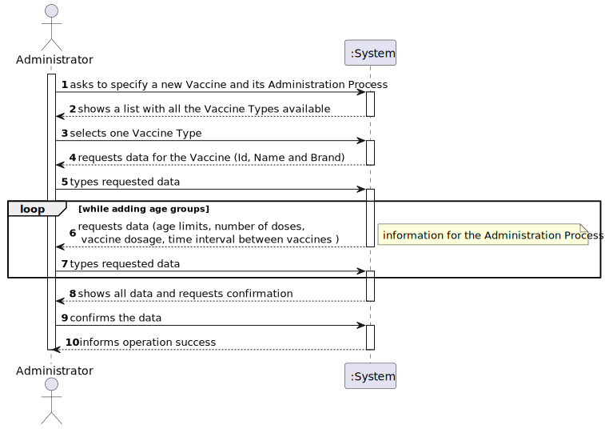
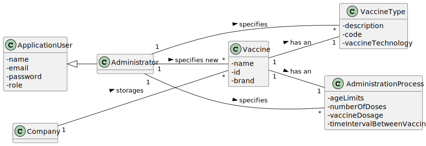

# US 013 - Specify a new vaccine and its administration process

## 1. Requirements Engineering

### 1.1. User Story Description

As an **administrator**, I want to register a **new vaccine and its administration process**.

### 1.2. Customer Specifications and Clarifications 

**From the specifications document:**

> [...] it is worth noticing that for each type of vaccine, several vaccines might exist, each one demanding a distinct administration process.

> The vaccine administration process comprises (i) one or more age groups (e.g.: 5 to 12 years old, 13 to 18 years old, greater than 18 years old), and (ii) per age group, the doses to be administered (e.g.: 1, 2, 3), the vaccine dosage (e.g.: 30 ml), and the time interval regarding the previously administered dose. Regarding this, it is important to notice that between doses (e.g.: between the 1st and 2nd doses) the dosage to be administered might vary as well as the time interval elapsing between two consecutive doses (e.g.: between the 1st and 2nd doses 21 days might be required, while between the 2nd and the 3rd doses 6 months might be required).

**From the client clarifications:**

> **Question:**
>
> **Answer:**

### 1.3. Acceptance Criteria

There is no acceptance criteria.

### 1.4. Found out Dependencies

No dependencies were found.

### 1.5 Input and Output Data

**Input Data:**

- Name of the new vaccine;
- Number of age groups;
- Age limits for each age group;
- Number of doses, per age group;
- Vaccine dosage ( e.g.: 30 ml);
- Time interval between vaccines, considering the dose number given previously;

**Output Data:**

* (In)Success of the operation

### 1.6. System Sequence Diagram (SSD)

### 1.7 Other Relevant Remarks

No other relevant remarks.

## 2. OO Analysis

### 2.1. Relevant Domain Model Excerpt

### 2.2. Other Remarks

No other relevant remarks.

## 3. Design - User Story Realization 

### 3.1. Rationale

**The rationale grounds on the SSD interactions and the identified input/output data.**

| Interaction ID | Question: Which class is responsible for... | Answer  | Justification (with patterns)  |
|:-------------  |:--------------------- |:------------|:---------------------------- |
| Step 1  		 |	... interacting with the actor? | SpecifyVaccineAndAdminProcessUI   |  Pure Fabrication: there is no reason to assign this responsibility to any existing class in the Domain Model.   |
| 			  		 |	... coordinating the US? | SpecifyVaccineAndAdminProcessController | **Controller**  |
| Step 2	 |	... instantiating a new Vaccine  | Company | **Creator**: R1  |
| Step 3	 |	... instantiating a new Administration Process | Company/Vaccine |**Creator**: R1  |
| Step 4  		 |	...saving the inputted data for the Vaccine (name) ? | Vaccine | IE: A Vaccine has its own data |
| Step 5  		 |	...saving the inputted data for the Administration Process? | AdministrationProcess  | IE: An Administration Process has its own data |
| Step 6  |	... informing operation success | SpecifyVaccineAndAdminProcessUI  | **IE:** is responsible for user interactions  | 

### Systematization ##

According to the taken rationale, the conceptual classes promoted to software classes are: 

 * Vaccine
 * AdministrationProcess
 * Company (already implemented)

Other software classes (i.e. Pure Fabrication) identified: 
* SpecifyVaccineAndAdminProcessUI
* SpecifyVaccineAndAdminProcessController

## 3.2. Sequence Diagram (SD)

*In this section, it is suggested to present an UML dynamic view stating the sequence of domain related software objects' interactions that allows to fulfill the requirement.* 

## 3.3. Class Diagram (CD)

*In this section, it is suggested to present an UML static view representing the main domain related software classes that are involved in fulfilling the requirement as well as and their relations, attributes and methods.*

