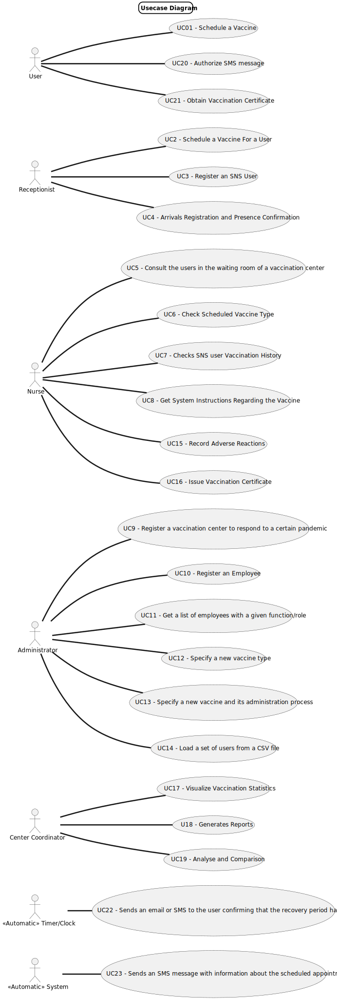

# Use Case Diagram (UCD)

**In the scope of this project, there is a direct relationship of _1 to 1_ between Use Cases (UC) and User Stories (US)
.**

However, be aware, this is a pedagogical simplification. On further projects and curricular units might also exist _1 to
N **and/or** N to 1 relationships between US and UC.

**For each UC/US, it must be provided evidences of applying main activities of the software development process (
requirements, analysis, design, tests and code). Gather those evidences on a separate file for each UC/US and set up a
link as suggested below.**

# Use Cases / User Stories

## User

| UC/US   | Description                                                                               |
|:--------|:------------------------------------------------------------------------------------------|
| US 001  | As a SNS user, I intend to use the application to schedule a vaccine.                     |
| US 0015 | Obtain Digital Certificate                                                                |

## Receptionist

| UC/US  | Description                                                                                                    |
|:-------|:---------------------------------------------------------------------------------------------------------------|
| US 002 | As a receptionist at one vaccination center, I want to schedule a vaccination.                                 |
| US 003 | As a receptionist, I want to register a SNS user.                                                              |
| US 004 | As a receptionist at a vaccination center, I want to register the arrival of a SNS userto take the vaccine.    |

## Nurse

| UC/US  | Description                                                                           |
|:-------|:--------------------------------------------------------------------------------------|
| US 005 | As a nurse, I intend to consult the users in the waiting room of a vacination center. |
| US 006 | Checks Scheduled Vaccine Type                                                         |
| US 008 | Checks SNS user Vaccination History                                                   |
| US 021 | Get System Instructions Regarding the Vaccine                                         |
| US 022 | Record Adverse Reactions                                                              |
| US 023 | Issue Vaccination Certificate                                                         |

## Administrator

| UC/US  | Description                                                    |                   
|:-------|:---------------------------------------------------------------|
| US 009 | Register a vaccination center to respond to a certain pandemic |
| US 010 | Register an Employee                                           |
| US 011 | Get a list of employees with a given function/role             |
| US 012 | Specify a new vaccine type                                     |
| US 013 | Specify a new vaccine and its administration process           |
| US 014 | I want to load a set of users from a CSV file                  |

## Centre Coordinator

| UC/US  | Description                                                     |                   
|:-------|:----------------------------------------------------------------|
| US 018 | As a center coordinator, I want to get a list of all vaccines.  |
| US 019 | Generates Reports                                               |
| US 020 | Analyse and Comparison                                          |

## Timer

| UC/US   | Description                                                         |
|:--------|:--------------------------------------------------------------------|
| US 002  | Sends an email or SMS Confirming that the Recovery Period has Ended |
