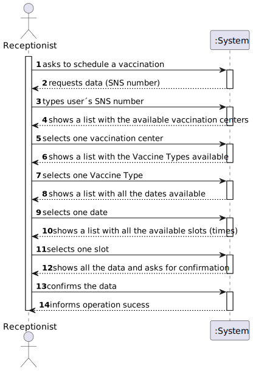
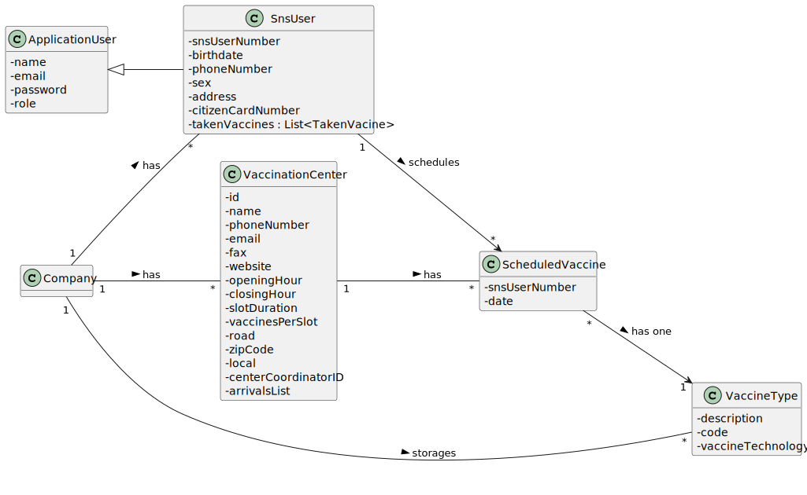
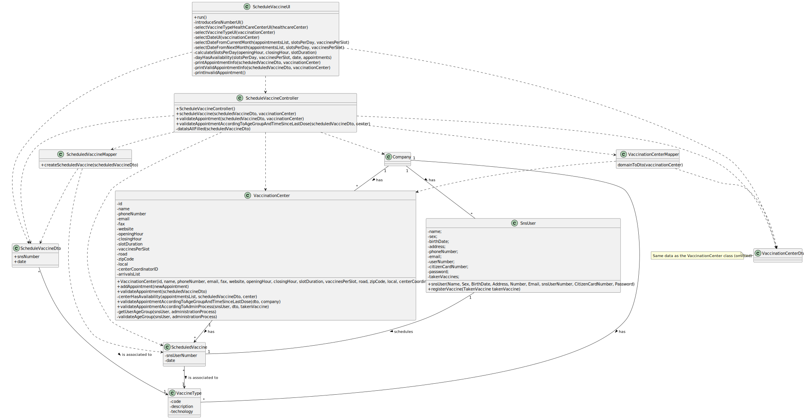

# US 002 - Schedule Vaccination

## 1. Requirements Engineering

### 1.1. User Story Description

As a **receptionist**, I want to schedule a **vaccination**.

### 1.2. Customer Specifications and Clarifications

**From the specifications document:**

> Moreover, receptionists working in the healthcare centers can issue and deliver on site a vaccination certificate whenever an SNS user asks for it.

> The user should select [...] the type of vaccine to be administered (by default, the system suggests the one related to the ongoing outbreak).

**From the client clarifications:**

> **Question:** Receptionists have the ability to schedule an appointment in different vaccination centres or only on their own?
>
> **Answer** The receptionist has the ability to schedule the vaccine in any vaccination center. The receptionist should ask the SNS user to indicate/select the preferred vaccination center.

> **Question:** How should we verify that a vaccination center is already registered in the system? Which attribute should the system use to verify this (ex. name, phone number)?
>
> **Answer** To schedule a vaccination, a user (US1) or a receptionist (US2) should select a vaccination center from a list.

> **Question:** When a receptionist schedules a vaccination for an SNS user, should they be presented with a list of available vaccines (brands, that meet acceptance criteria) from which to choose?
Or should the application suggest only one?
>
> **Answer** The receptionist do not select the vaccine brand. When the user is at the vaccination center to take the vaccine, the nurse selects the vaccine. 
In Sprint D we will introduce new USs where the nurse records the administration of a vaccine to a SNS user.

> **Question:** We are unsure if it's in this user stories that's asked to implement the "send a SMS message with information about the scheduled appointment" found on the Project Description available in moodle. Could you clarify?
>
> **Answer** [...] A file named SMS.txt should be used to receive/record the SMS messages. We will not use a real word service to send SMSs.

### 1.3. Acceptance Criteria

* **AC1:** Check if the SNS User is within the age.
* **AC2:** Time since the last vaccine.
* **AC3:** All data must be filled.
* **AC4:** Vaccination Center availability.

### 1.4. Found out Dependencies

Exists a dependency related to US001, since to get the last time a User has taken a vaccine there must have been a
previous scheduling of a vaccine.
US002 is also dependent on the US013, as a matter effect the system must have registered vaccines in order to schedule a
vaccination.
There is also a dependency related to both US003 and US014, because to schedule vaccination there must be SNS Users.

### 1.5 Input and Output Data

**Input Data:**

* Typed data:
    - SNS Number;

* Selected data:
    - Vaccination Center;
    - Type of vaccine to be administered;
    - Date and Time;

**Output Data:**

* A list with all the available vaccination centers.
* A list with all the available dates and times.
* (In)Success of the operation (confirm that the vaccination is scheduled).
* inform the user that (s)he should be at the vaccination center (the one where (s)he scheduled the vaccine with the receptionist) at the scheduled day and time.

### 1.6. System Sequence Diagram (SSD)

### 1.7 Other Relevant Remarks

## 2. OO Analysis

### 2.1. Relevant Domain Model Excerpt

### 2.2. Other Remarks

No other relevant remarks.

## 3. Design - User Story Realization

### 3.1. Rationale

**The rationale grounds on the SSD interactions and the identified input/output data.**

| Interaction ID | Question: Which class is responsible for...                    | Answer                          | Justification (with patterns)                                                                                                                                              |
|:---------------|:---------------------------------------------------------------|:--------------------------------|:---------------------------------------------------------------------------------------------------------------------------------------------------------------------------|
| Step 1         | ...interacting with the actor?                                 | ScheduleVaccinationUI           | Pure Fabrication: there is no reason to assign this responsibility to any existing class in the Domain Model.                                                              |
| 			  		        | ...coordinating the US?                                        | ScheduleVaccinationController   | **Controller**                                                                                                                                                             |
| Step 2         | ...transfer the data typed in the UI to the domain?            | VaccineAndAdminProcessDto       | **DTO:** When there is so much data to transfer, it is better to opt by using a DTO in order to reduce coupling between UI and domain                                      |
| Step 3         | ...instantiating a new Vaccine                                 | Company                         | By applying the **Creator** pattern, the "Company" is responsible for instantiating a new "Vaccine", since it is the one who storages the Vaccines.                        |
| 	              | ...instantiating a new Administration Process                  | Vaccine                         | By applying the **Creator** pattern, the "Vaccine" is responsible for instantiating the "Administration Process", since a "Vaccine" has/contains an Administration Process |
| Step 4         | ...validating the inputted data for the Vaccine                | Vaccine                         | The Vaccine class should know what needs to be validated in order to actually create a "Vaccine"                                                                           |
| 		             | ...validating the inputted data for the Administration Process | Administration Process          | The Administration Process class should know what needs to be validated in order to actually create an "Administration Process"                                            |
| Step 5         | ...saving the inputted data for the Vaccine ?                  | Vaccine                         | **IE:** A Vaccine has its own data                                                                                                                                         |
| 		             | ...saving the inputted data for the Administration Process?    | AdministrationProcess           | **IE:** An Administration Process has its own data                                                                                                                         |
| Step 7         | ...informing operation success                                 | SpecifyVaccineAndAdminProcessUI | **IE:** is responsible for user interactions                                                                                                                               | 

### Systematization ##

According to the taken rationale, the conceptual classes promoted to software classes are:

* VaccineAndAdminProcessDto
* Vaccine
* AdministrationProcess
* Company (already implemented)

Other software classes (i.e. Pure Fabrication) identified:

* SpecifyVaccineAndAdminProcessUI
* SpecifyVaccineAndAdminProcessController

## 3.2. Sequence Diagram (SD)

## 3.3. Class Diagram (CD)

*In this section, it is suggested to present an UML static view representing the main domain related software classes
that are involved in fulfilling the requirement as well as and their relations, attributes and methods.*

