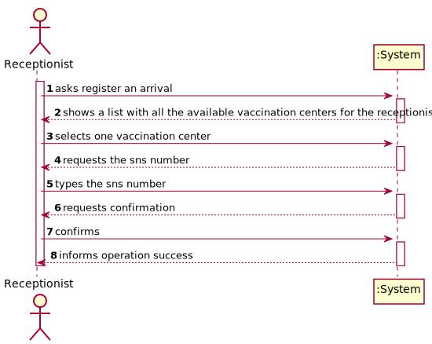
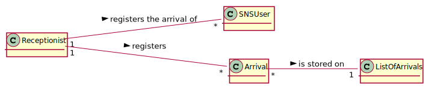
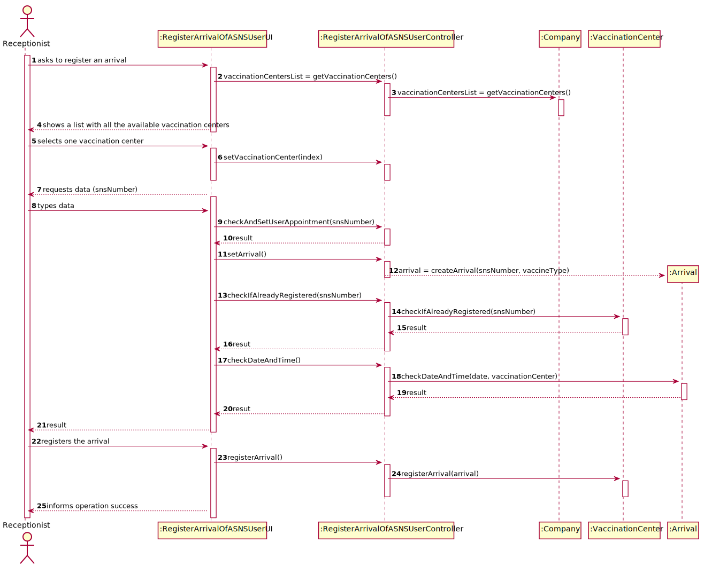
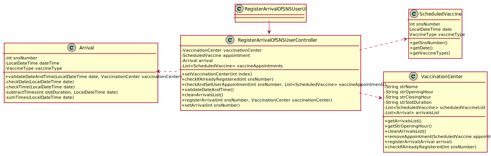

# US 006 - To register the arrival of a SNS user

## 1. Requirements Engineering

### 1.1. User Story Description

As a receptionist, I want to register the arrival of an SNS user so that the SNS user can take the vaccine.

### 1.2. Customer Specifications and Clarifications 

**From the specifications document:**

>	The receptionist asks the SNS user for his/her SNS user number and
confirms that he/she has the vaccine scheduled for the that day and time. If the information is
correct, the receptionist acknowledges the system that the user is ready to take the vaccine.

**From the client clarifications:**

> **Question:** 
>  
> **Answer:** 

-

### 1.3. Acceptance Criteria

* **AC1:** No duplicate entries should be possible for the same SNS user on the same day or vaccine period.

### 1.4. Found out Dependencies

* There is a dependency to "US001 and US002 schedule a vaccination" since in order to an SNS user go to a vaccination center
he/she needs to have a vaccination appointment.

### 1.5 Input and Output Data

**Input Data:**

* Typed data:
    * SNS number
    * The choosen Vaccination Center
    

**Output Data:**

* (In)Success of the operation

### 1.6. System Sequence Diagram (SSD)

### 1.7 Other Relevant Remarks

* No other relevant remarks

## 2. OO Analysis

### 2.1. Relevant Domain Model Excerpt 

### 2.2. Other Remarks

No other remarks

## 3. Design - User Story Realization 

### 3.1. Rationale

| Interaction ID | Which class responsible for...              | Answer                             | Justification                                                                                                 |
|:---------------|:--------------------------------------------|:-----------------------------------|:--------------------------------------------------------------------------------------------------------------|
| Step 1         | ...interacting with the actor?              | RegisterArrivalOfSNSUserUI         | Pure Fabrication: there is no reason to assign this responsibility to any existing class in the Domain Model. |
|                | ...coordinating the US                      | RegisterArrivalOfSNSUserController | **Controller**                                                                                                |
| Step 2         | ...check the requirements for registration  | Arrival                            | **Validation**                                                                                                | 
| Step 2         | ...register the arrival of an SNS user      | Company                            | **Registration**                                                                                              |
| Step 3         | ...saving the inputted data of the arrival  | VaccinationCenter                  | IE: Company stores everything                                                                                 |
| Step 4         | ...informing operation success              | RegisterArrivalOfSNSUserUI         | IE: is responsible for user interactions                                                                      |

### Systematization ##

According to the taken rationale, the conceptual classes promoted to software classes are: 

 * None

Other software classes (i.e. Pure Fabrication) identified: 

 * CreateTaskUI  
 * CreateTaskController
 * Company

## 3.2. Sequence Diagram (SD)

## 3.3. Class Diagram (CD)

