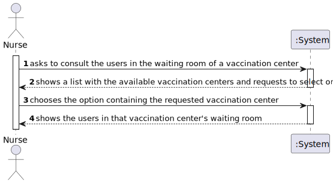
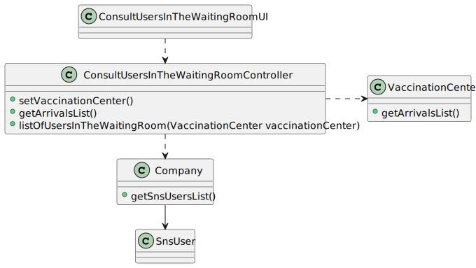

# US 006 - To create a Task 

## 1. Requirements Engineering

### 1.1. User Story Description

>* **_As a nurse, I intend to consult the users in the waiting room of a vaccination centre_**

### 1.2. Customer Specifications and Clarifications 

**From the specifications document:**

>	Each task is characterized by having a unique reference per organization, a designation, an informal and a technical description, an estimated duration and cost as well as the its classifying task category. 

>	As long as it is not published, access to the task is exclusive to the employees of the respective organization. 

**From the client clarifications:**

> **Question:** In the PI description it is said that, by now, the nurses and the receptionists will work at any centre. Will this information remain the same on this Sprint?

> **Answer:** 
 
> **Question** What does consulting constitute in this context? Does it refer only to seeing who is present and deciding who gets the vaccine or is checking the user info to administer the vaccine, registering the process, and sending it to the recovery room also part of this US?

> **Answer**
 
> **Question** Do we need to know if the nurse have to choose the vaccination centre before executing the list or if that information comes from the employee file?
 
> **Answer**
  
> **Question** Do we need to know what is the name of the attribute that defines that the user has arrived? In the last sprint we have created the “Status” attribute, can we continue using it?
 
> **Answer**
 
> **Question** Which are the attributes of the waiting room?

> **Answer**

### 1.3. Acceptance Criteria

>* **AC1:** SNS Users' list should be presented by order of arrival.

### 1.4. Found out Dependencies

>* There is a dependency to "US004 - register the arrival of a SNS user to take the vaccine" since in order to consult the users in a waiting room of a vaccination centre, they must arrive at one.

### 1.5 Input and Output Data

**Input Data:**

> Select the option to get a list of SNS Users in the waiting room of a vaccination centre.

**Output Data:**

> A list containing the SNS Users in the waiting room of a vaccination centre.

### 1.6. System Sequence Diagram (SSD)

**Alternative 1**

**Alternative 2**

**Other alternatives might exist.**

### 1.7 Other Relevant Remarks

* The created task stays in a "not published" state in order to distinguish from "published" tasks.

## 2. OO Analysis

### 2.1. Relevant Domain Model Excerpt 

### 2.2. Other Remarks

n/a

## 3. Design - User Story Realization 

### 3.1. Rationale

**SSD - Alternative 1 is adopted.**

| Interaction ID | Question: Which class is responsible for... | Answer  | Justification (with patterns)  |
|:-------------  |:--------------------- |:------------|:---------------------------- |
| Step 1  		 |	... interacting with the actor? | CreateTaskUI   |  Pure Fabrication: there is no reason to assign this responsibility to any existing class in the Domain Model.           |
| 			  		 |	... coordinating the US? | CreateTaskController | Controller                             |
| 			  		 |	... instantiating a new Task? | Organization   | Creator (Rule 1): in the DM Organization has a Task.   |
| 			  		 | ... knowing the user using the system?  | UserSession  | IE: cf. A&A component documentation.  |
| 			  		 |	... knowing to which organization the user belongs to? | Platform  | IE: has registed all Organizations |
| 			  		 |							 | Organization   | IE: knows/has its own Employees|
| 			  		 |							 | Employee  | IE: knows its own data (e.g. email) |
| Step 2  		 |							 |             |                              |
| Step 3  		 |	...saving the inputted data? | Task  | IE: object created in step 1 has its own data.  |
| Step 4  		 |	...knowing the task categories to show? | Platform  | IE: Task Categories are defined by the Platform. |
| Step 5  		 |	... saving the selected category? | Task  | IE: object created in step 1 is classified in one Category.  |
| Step 6  		 |							 |             |                              |              
| Step 7  		 |	... validating all data (local validation)? | Task | IE: owns its data.| 
| 			  		 |	... validating all data (global validation)? | Organization | IE: knows all its tasks.| 
| 			  		 |	... saving the created task? | Organization | IE: owns all its tasks.| 
| Step 8  		 |	... informing operation success?| CreateTaskUI  | IE: is responsible for user interactions.  | 

### Systematization ##

According to the taken rationale, the conceptual classes promoted to software classes are: 

 * Organization
 * Platform
 * Task

Other software classes (i.e. Pure Fabrication) identified: 

 * CreateTaskUI  
 * CreateTaskController

## 3.2. Sequence Diagram (SD)

**Alternative 1**

**Alternative 2**

## 3.3. Class Diagram (CD)

**From alternative 1**

