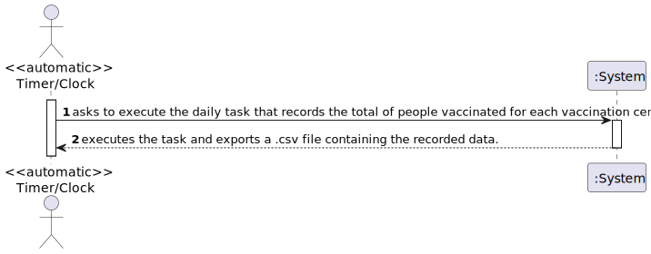
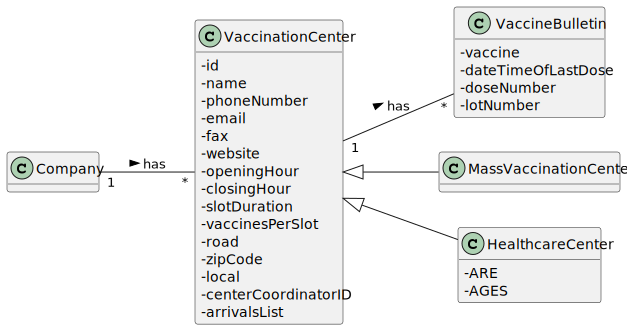
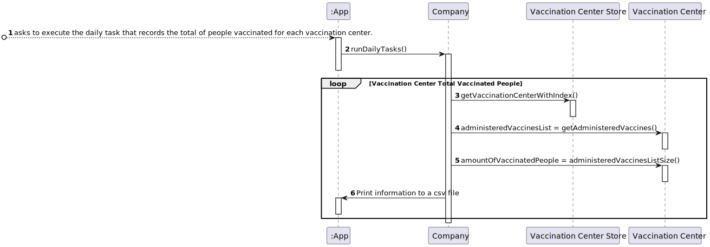
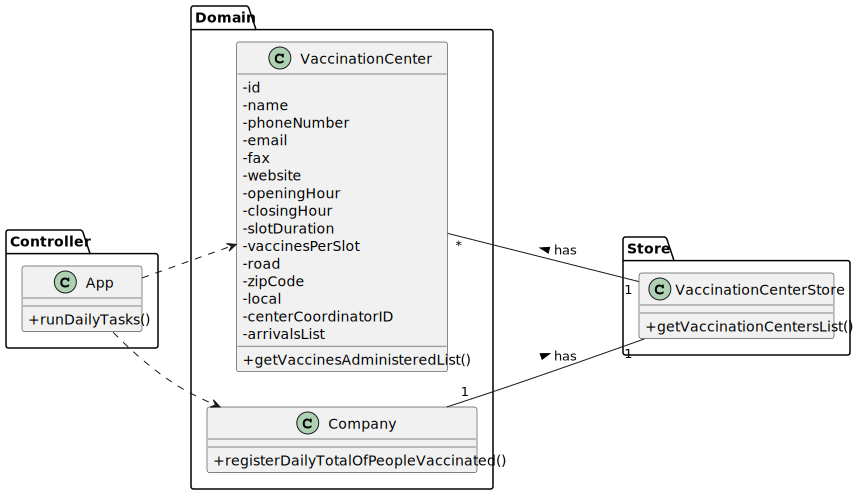

# US 006 - Record the daily total of vaccinated people in each vaccination center. 

## 1. Requirements Engineering

### 1.1. User Story Description

>* **_DGS wants to record daily the total number of people vaccinated in each vaccination center._**

### 1.2. Customer Specifications and Clarifications 

**From the specifications document:**

> **_The Center Coordinator wants to monitor the vaccination process, to see statistics and charts, to evaluate the performance of the vaccination process, generate reports and analyze data from other centers, including data from legacy systems._**

**From the client clarifications:**

> **Question:** Dear client, In the acceptance criteria, "the algorithm should run automatically at a time defined in a configuration file and should register a date, the name of the vaccination center and the total number of vaccinated users." How is it supposed to register this information? Should it be recorded in a file (ex: txt,...) or recorded in the system (ex: in a store) ?
 
> **Answer:** The data should be written to a CSV file (field delimiter should be a semicolon).

### 1.3. Acceptance Criteria

* **AC1:** The algorithm should run automatically at a time defined in a configuration file and should register the date, the name of the vaccination center and the total number of vaccinated users.

### 1.4. Found out Dependencies

>* There is a dependency found in US008 "As a nurse, I want to record the administration of a vaccine to a SNS user. At the end of the recovery period, the user should receive a SMS message informing the SNS user that he can leave the vaccination center.", because in order to get the daily number of vaccinated people, it's necessary that people get vaccinated.

### 1.5 Input and Output Data

**Input Data:**

>* There is no typed or selected data for the input.

**Output Data:**

>* A ".csv" file is created and the information about the daily total vaccinated people in each vaccinated center is exported to that file.

### 1.6. System Sequence Diagram (SSD)

### 1.7 Other Relevant Remarks

> *_There aren't any other relevant remarks._*

## 2. OO Analysis

### 2.1. Relevant Domain Model Excerpt 

### 2.2. Other Remarks

> *_There aren't any other relevant remarks._*

## 3. Design - User Story Realization 

### 3.1. Rationale

| *Interaction ID* | *Question: Which class is responsible for...* | *Answer*  | *Justification (with patterns)*  |
|:-------------    |:---------------------                         |:----------| :------------------------------- |
| Step 1  		   | ...asking to execute the task	 | ???     | **Pure Fabrication:** There is no need to assign this responsibility to any other existing classes.   | 
| Step 2  		   | ...executing the task      	 | App     | **Controller:** Intermediates the information between whats shown to the User and the domain.         | 
|          		   | ...creating the csv file with the data	         | Company | **IE:** Has the necessary information to create the requested file.   | 
|          		   | ...supplying the list of vaccination centers         | Company | **IE:** Knows all vaccination centers.   |
|          		   | ...supplying the list of vaccine bulletins         | VaccinationCenter | **IE:** Knows it's own vaccine bulletins.   |

### Systematization ##

According to the taken rationale, the conceptual classes promoted to software classes are: 

* VaccinationCenter.

Other software classes (i.e. Pure Fabrication) identified: 

* Company.
* App.

## 3.2. Sequence Diagram (SD)

## 3.3. Class Diagram (CD)

