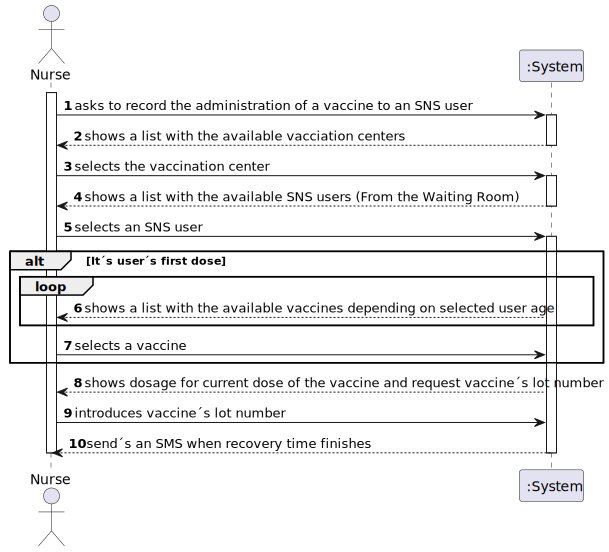
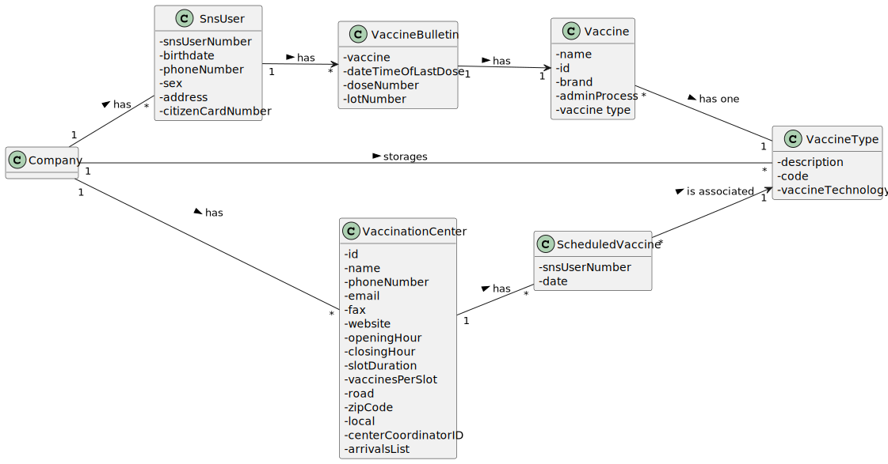

# US 008 - Record the administration of a vaccine to an SNS User. 

## 1. Requirements Engineering

### 1.1. User Story Description

>* **_As a nurse, I want to record the administration of a vaccine to an SNS user. At the end of the recovery period, the user should receive an SMS message informing the SNS user that he can leave the vaccination center._**

### 1.2. Customer Specifications and Clarifications 

**From the specifications document:**

> **_After giving the vaccine to the user, each nurse registers the event in the system, more precisely, registers the vaccine type (e.g.: Covid-19), vaccine name/brand (e.g.: Astra Zeneca, Moderna, Pfizer), and the lot number used._**

**From the client clarifications:**

### 1.3. Acceptance Criteria

* **AC1:** The nurse should select a vaccine and the administered dose number.

### 1.4. Found out Dependencies

### 1.5 Input and Output Data

**Input Data:**

>* Vaccine;
>* Dose number.

**Output Data:**

>* SMS message informing that the user can leave.

### 1.6. System Sequence Diagram (SSD)

**Alternative 1**

### 1.7 Other Relevant Remarks

>*

## 2. OO Analysis

### 2.1. Relevant Domain Model Excerpt 

### 2.2. Other Remarks

> *_There aren't any other relevant remarks._*

## 3. Design - User Story Realization 

### 3.1. Rationale

**SSD - Alternative 1 is adopted.**

| *Interaction ID* | *Question: Which class is responsible for...* | *Answer*  | *Justification (with patterns)*  |
|:-------------  |:--------------------- |:------------|:---------------------------- |
| Step 1  		 |	... interacting with the actor?	 |       RecordVaccineAdministrationUI      |    *Pure Fabrication:* The UI class is responsible for the direct interaction with the user through the controller and the different other implemented classes. | Step 2  		 |							 |             |                              |
| |... coordinating the US? | RecordVaccineAdministrationUController| *Controller:* Intermediary between the UI and the Domain Model, and as its name says, controls the information that is transferred between both of them. | |
### Systematization ##

According to the taken rationale, the conceptual classes promoted to software classes are: 

 *

Other software classes (i.e. Pure Fabrication) identified: 

 * RecordVaccineAdministrationUI  
 * RecordVaccineAdministrationUController

## 3.2. Sequence Diagram (SD)

**Alternative 1**

## 3.3. Class Diagram (CD)

**From alternative 1**

