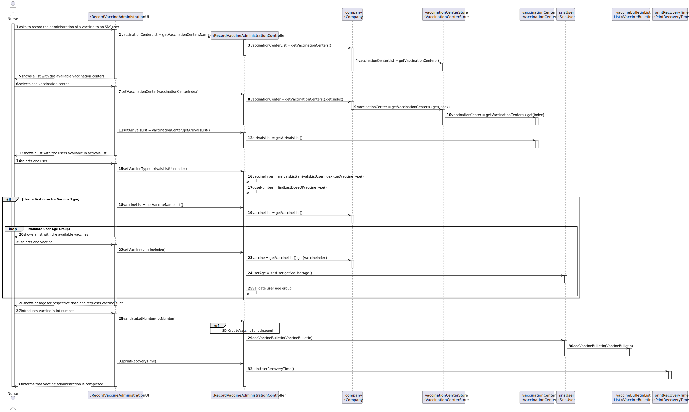
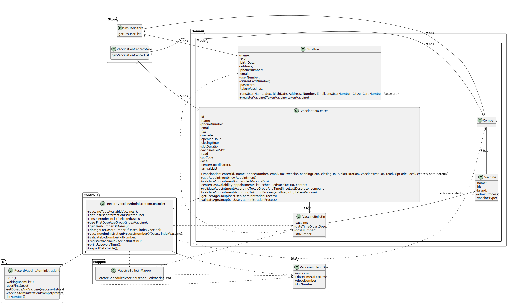

# US 008 - Record the administration of a vaccine to an SNS User. 

## 1. Requirements Engineering

### 1.1. User Story Description

>* **_As a nurse, I want to record the administration of a vaccine to an SNS user. At the end of the recovery period, the user should receive an SMS message informing the SNS user that he can leave the vaccination center._**

### 1.2. Customer Specifications and Clarifications 

**From the specifications document:**

> **_After giving the vaccine to the user, each nurse registers the event in the system, more precisely, registers the vaccine type (e.g.: Covid-19), vaccine name/brand (e.g.: Astra Zeneca, Moderna, Pfizer), and the lot number used._**

**From the client clarifications:**

> **Question:** "Supposing that the SNS user has already received a dose of a given vaccine type (for example, COVID-19), the user can only receive the same vaccine or a different one with the same vaccine type?"
>
> **Answer:** The SNS user can only receive the same vaccine. An SNS user that has received a single-dose vaccine is considered fully vaccinated and will not take more doses. 
An SNS user that is fully vaccinated will not be able to schedule a new vaccine of the type for which he is already fully vaccinated.

> **Question:** "1: The system displays the list of possible vaccines to be administered (considering the age group of the user); then the nurse selects the dose she is going to administer and gets information about the dosage. But wouldn't it be more correct, since the system knows the vaccination history, in other words, if the user has already take x dose(s) of that vaccine, to simply show the dose and the respective dosage and not ask for the nurse to arbitrarily select it?
2: After giving the vaccine to the user, how should the nurse register the vaccine type? by the code?"
>
> **Answer:** 1- If it is the first dose, the application should show the list of possible vaccines to be administered. If is is not a single dose vaccine, when the SNS user arrives to take the vaccine, the system should simply show the dose and the respective dosage.
2- A vaccine is associated with a given vaccine type. Therefore, there is no need to register the vaccine type.
Moreover, the nurse should also register the vaccine lot number (the lot number has five alphanumeric characters an hyphen and two numerical characters (example: 21C16-05)).

> **Question:** "To access the user info - scheduled vaccine type and vaccination history -, should the nurse enter user's SNS number?"
>
> **Answer:** The nurse should select a SNS user from a list of users that are in the center to take the vaccine.

> **Question:** "As we can read in Project Description, the vaccination flow follows these steps: 1. Nurse calls one user that is waiting in the waiting room to be vaccinated, 
2.Nurse checks the user's health data as well as which vaccine to administer; 3. Nurse administers the vaccine and registers its information in the system.
The doubt is: do you want US08 to cover steps 2 and 3, or just step 3?"
>
> **Answer:** 1.The nurse selects a SNS user from a list. 2. Checks user's Name, Age and Adverse Reactions registered in the system. 3. Registers information about the administered vaccine.

### 1.3. Acceptance Criteria

* **AC1:** The nurse should select a vaccine and the administered dose number.
* **AC2:** All required data must be filled.
* **AC3:** The SNS User must be is within the age of the Vaccine.

### 1.4. Found out Dependencies

There is a dependency related to the US003 and US014, since for an SNS User to have a vaccine administered there's the need of having him registered in the System.
There is a dependency to the US009 and US013, since in order to administer a vaccine it is required that the System has Vaccination Centers and Vaccines, respectively.
There is a dependency to the US001 and US002, because it is required a scheduled vaccine in order to be vaccinated.

### 1.5 Input and Output Data

**Input Data:**
* Typed data:
    - Lot Number;

* Selected data:
    - Vaccination Center;
    - Sns User (From the waiting room list);
    - Vaccine;

**Output Data:**

>* A list with all the Vaccination Centers available 
>* A list with all the Users in the Waiting Room
>* A list with all the Vaccine available
>* SMS message informing that the recovery time is over and that the user can leave,

### 1.6. System Sequence Diagram (SSD)

**Alternative 1**

### 1.7 Other Relevant Remarks

## 2. OO Analysis

### 2.1. Relevant Domain Model Excerpt 

### 2.2. Other Remarks

> *_There aren't any other relevant remarks._*

## 3. Design - User Story Realization 

### 3.1. Rationale

**SSD - Alternative 1 is adopted.**

| *Interaction ID* | *Question: Which class is responsible for...* | *Answer*  | *Justification (with patterns)*  |
|:-------------  |:--------------------- |:------------|:---------------------------- |
| Step 1  		 |	... interacting with the actor?	 |       RecordVaccineAdministrationUI      |    *Pure Fabrication:* The UI class is responsible for the direct interaction with the user through the controller and the different other implemented classes. | Step 2  		 |							 |             |                              |
| |... coordinating the US? | RecordVaccineAdministrationUController| *Controller:* Intermediary between the UI and the Domain Model, and as its name says, controls the information that is transferred between both of them. | |
### Systematization ##

According to the taken rationale, the conceptual classes promoted to software classes are: 

 *

Other software classes (i.e. Pure Fabrication) identified: 

 * RecordVaccineAdministrationUI  
 * RecordVaccineAdministrationUController

## 3.2. Sequence Diagram (SD)

**Alternative 1**

## 3.3. Class Diagram (CD)

**From alternative 1**

