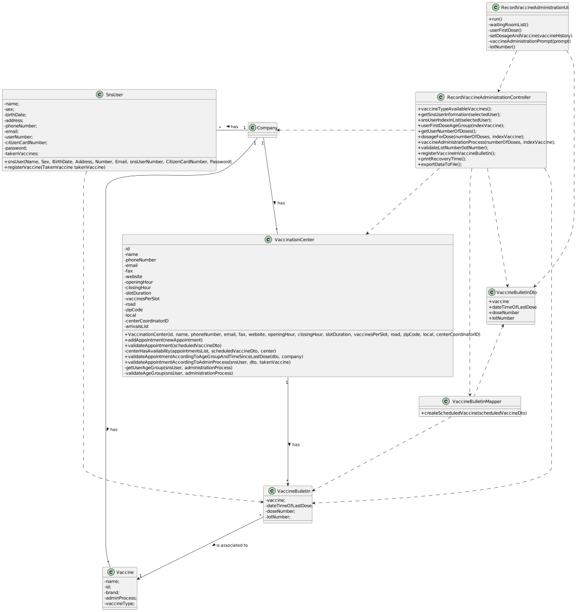

# US 008 - Check and export vaccination statistics

## 1. Requirements Engineering

### 1.1. User Story Description

As a **Center Coordinator**, I intend to **check** and **export** vaccination statistics. 
I want to export, to a csv file, the total number of fully vaccinated users per day.

### 1.2. Customer Specifications and Clarifications 

**From the specifications document:**

> Each vaccination center has a Center Coordinator that has the responsibility to manage the Covid19 vaccination process. The Center Coordinator wants to monitor the vaccination process, to see
statistics and charts, to evaluate the performance of the vaccination process, generate reports

>The goal of this US is to explore this data jointly with data obtained from external sources to estimate the number of new cases and the number of deaths using information about the Reproduction Rate, Number of ICU Patients, Number of In-Hospital Patients, Number of New Cases, Positive Rate and Number of People Fully Vaccinated. In this study, simple linear and a multi-linear regression models should be developed to find the linear relationship between: 1- each independent variable and each dependent variable; 2- all six independent variables and each dependent variable; 3- three selected variables and each dependent variable. As the application is under development it is not possible to generate all data required for the analysis. Therefore, and to simulate a production system, we made available in moodle a file containing all the information required for this study. The regression analysis should be made outside the application and should be performed using Microsoft Excel spreadsheet program. The regression analysis should be documented in the application user manual (in the annexes) that must be delivered with the application. The report should include day and week (observed and estimated) values, the regression model used to estimate each value, R(SLR), R2 and R2 adjusted for SLR and MLR, confidence intervals and hypothesis tests for regression coefficients and significance model with Anova.

**From the client clarifications:**

### 1.3. Acceptance Criteria

* **AC1:** A file with the Vaccination Statistics is created.

### 1.4. Found out Dependencies

There is a dependency with US006, as it is required to have the necessary information that that US provides in order to create a file with the vaccination statistics.

### 1.5 Input and Output Data

**Output Data:**

> The Vaccination Statistics;
> A file with the Vaccination Statistics.

### 1.6. System Sequence Diagram (SSD)

### 1.7 Other Relevant Remarks

> 

## 2. OO Analysis

### 2.1. Relevant Domain Model Excerpt 

### 2.2. Other Remarks

> *_There aren't any other relevant remarks._*

## 3. Design - User Story Realization 

### 3.1. Rationale

**SSD - Alternative 1 is adopted.**

| *Interaction ID* | *Question: Which class is responsible for...* | *Answer*  | *Justification (with patterns)*  |
|:-------------  |:--------------------- |:------------|:---------------------------- |
| Step 1  		 |	... interacting with the actor?	 |       RecordVaccineAdministrationUI      |    *Pure Fabrication:* The UI class is responsible for the direct interaction with the user through the controller and the different other implemented classes. | Step 2  		 |							 |             |                              |
| |... coordinating the US? | RecordVaccineAdministrationUController| *Controller:* Intermediary between the UI and the Domain Model, and as its name says, controls the information that is transferred between both of them. | |
### Systematization ##

According to the taken rationale, the conceptual classes promoted to software classes are: 

 *

Other software classes (i.e. Pure Fabrication) identified: 

 * RecordVaccineAdministrationUI  
 * RecordVaccineAdministrationUController

## 3.2. Sequence Diagram (SD)

**Alternative 1**

## 3.3. Class Diagram (CD)

**From alternative 1**

