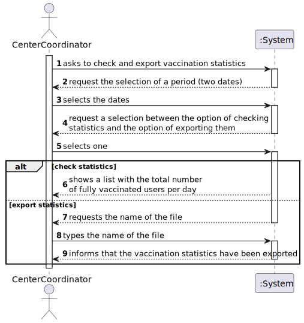
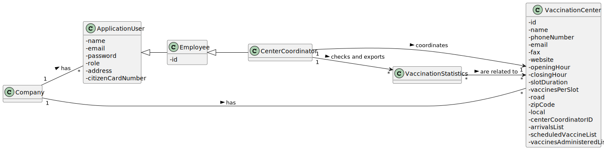

# US 008 - Check and export vaccination statistics

## 1. Requirements Engineering

### 1.1. User Story Description

As a **Center Coordinator**, I intend to **check** and **export** vaccination statistics. 
I want to export, to a csv file, the total number of fully vaccinated users per day.

### 1.2. Customer Specifications and Clarifications

### **From the specifications document:**

> Each vaccination center has a Center Coordinator that has the responsibility to manage the Covid19 vaccination process. The Center Coordinator wants to monitor the vaccination process, to see
statistics and charts, to evaluate the performance of the vaccination process, generate reports

### **From the client clarifications:**

**-From the requirements document:**
>The goal of this US is to explore this data jointly with data obtained from external sources to estimate the number of new cases and the number of deaths using information about the Reproduction Rate, Number of ICU Patients, Number of In-Hospital Patients, Number of New Cases, Positive Rate and Number of People Fully Vaccinated. In this study, simple linear and a multi-linear regression models should be developed to find the linear relationship between: 1- each independent variable and each dependent variable; 2- all six independent variables and each dependent variable; 3- three selected variables and each dependent variable. As the application is under development it is not possible to generate all data required for the analysis. Therefore, and to simulate a production system, we made available in moodle a file containing all the information required for this study. The regression analysis should be made outside the application and should be performed using Microsoft Excel spreadsheet program. The regression analysis should be documented in the application user manual (in the annexes) that must be delivered with the application. The report should include day and week (observed and estimated) values, the regression model used to estimate each value, R(SLR), R2 and R2 adjusted for SLR and MLR, confidence intervals and hypothesis tests for regression coefficients and significance model with Anova.

**-From the client forum:**

>**Questions:** 
> 
>1- When exporting vaccination statistics,do we export the data from all days available in the system or does the center coordinator chooses the time interval? 
>
>2-Is there any kind of format our exported data should follow?
> 
>**Answers:**
> 
>1- The user should define a time interval (two dates).
> 
>2- Data format: date; number of fully vaccinated user.

>**Question:**
>
>Is the exportation of the CSV file that contains the total number of fully vaccinated users per day, the only feature that needs to be implemented in code, for US15?
>
>**Answer:**
>
>Yes.

>**Questions:**
>
>1-Should the user introduce the name of the file intended to export the vaccination statistics ?
> 
> 2-Are the vaccination statistics referring only to the fully vaccinated users or referring to something more ?
>
>**Answer:**
>
>The user should introduce the name of the file.
> 
>Only to fully vaccinated users.

>**Question:**
>
>In this US should the Center Coordinator check and export the Vaccination Statistics of the Center where he/she works at or should just check and export the Vaccination Statistics of all centers?
>
>**Answer:**
>
>The center coordinator can only export statistics from the vaccination center that he coordinates.

### 1.3. Acceptance Criteria

* **AC1:** A file with the Vaccination Statistics is created.

### 1.4. Found out Dependencies

There is a dependency with US008, as it is required to have the necessary information that that US provides in order to create a file with the vaccination statistics.

### 1.5 Input and Output Data

**Input Data:**

* Typed data:
    - The name of the file intended to export the vaccination statistics.

* Selected data:
    - The time interval.
    - Between the options of checking or exporting the vaccination statistics.

**Output Data:**

The Vaccination Statistics;
 A file with the Vaccination Statistics.

### 1.6. System Sequence Diagram (SSD)

### 1.7 Other Relevant Remarks

>No other relevant remarks.

## 2. OO Analysis

### 2.1. Relevant Domain Model Excerpt 

### 2.2. Other Remarks

> VaccinationStatistics represents the statistics of the vaccination process.
> By the VaccinationStatistics we get the total number of fully vaccinated users per day, in a center.
> The same center can have several statistics, as the Center Coordinator can check and export statistics for different time intervals.
> Per example: the Center Coordinator can check the statistics from day 1 to 10 of a month, and then export the statistics from day 10 to 20 of the next month. Therefore, those are different statistics.

## 3. Design - User Story Realization 

### 3.1. Rationale

| Interaction ID | Question: Which class is responsible for... | Answer  | Justification (with patterns)  |
|:-------------  |:--------------------- |:------------|:---------------------------- |
| Step 1         |    ... showing the list with all datas for the user to select from | CheckAndExportVacStatsGUI   |  **Pure Fabrication:** there is no reason to assign this responsibility to any existing class in the Domain Model.   |
| 			  		 |    ... disponibilize the previous list to the ScheduleVaccineUI  | ScheduleVaccineController | **Controller:** act as a mediator between the UI and the Model. Has the responsibility of controlling the data transmission between both. It maps the user action into model updates.  |
| 			  		 |    ... disponibilize the previous list to the ScheduleVaccineController  | Company | **IE:** The Company knows all of it's Vaccination Centers.  |
| | ...saving the selected Vaccination Center | ScheduleVaccineController | **IE:** the controller needs to know the selected Vaccination Center throughout the whole process of scheduling a Vaccine |
| Step 2         |    ... showing the list with all the Vaccine Types available for the selected Vaccination Center | ScheduleVaccineUI   |  **Pure Fabrication:** there is no reason to assign this responsibility to any existing class in the Domain Model.   |
| 			  		 |    ... disponibilize the previous list to the ScheduleVaccineUI  | ScheduleVaccineController | **Controller:** act as a mediator between the UI and the Model. Has the responsibility of controlling the data transmission between both. It maps the user action into model updates.  |
| 			  		 |    ... disponibilize the previous list to the ScheduleVaccineController  | VaccinationCenter | **IE:** The Vaccination Center knows all of it's Vaccine Types.  |
| | ...saving the selected Vaccine Type | ScheduleVaccineDto | **IE:** In order to schedule a Vaccine there are required: a Vaccine Type, a Date and an SNS number, therefore those have to be temporarily stored, so that in moment of instantiating an appointment all the information is together |
| Step 3         |    ... showing the list with all the available dates to schedule Vaccine | ScheduleVaccineUI   |  **Pure Fabrication:** there is no reason to assign this responsibility to any existing class in the Domain Model.   |
| 			  		 |    ... disponibilize the previous list to the ScheduleVaccineUI  | ScheduleVaccineController | **Controller:** act as a mediator between the UI and the Model. Has the responsibility of controlling the data transmission between both. It maps the user action into model updates.  |
| 			  		 |    ... disponibilize the appointments to the controller | VaccinationCenter | **IE:** The Vaccination Center knows all of it's Scheduled Vaccines.  |
| | ...saving the selected date | ScheduleVaccineDto | **IE:** In order to schedule a Vaccine there are required: a Vaccine Type, a Date and an SNS number, therefore those have to be temporarily stored, so that in moment of instantiating an appointment all the information is together   |
| Step 4         |    ... showing the list with all the available slots to schedule Vaccine | ScheduleVaccineUI   |  **Pure Fabrication:** there is no reason to assign this responsibility to any existing class in the Domain Model.   |
| 			  		 |    ... disponibilize the previous list to the ScheduleVaccineUI  | ScheduleVaccineController | **Controller:** act as a mediator between the UI and the Model. Has the responsibility of controlling the data transmission between both. It maps the user action into model updates.  |
| 			  		 |    ... disponibilize the appointments to the controller | VaccinationCenter | **IE:** The Vaccination Center knows all of it's Scheduled Vaccines.  |
| | ...saving the selected date | ScheduleVaccineDto | **IE:** In order to schedule a Vaccine there are required: a Vaccine Type, a Date and an SNS number, therefore those have to be temporarily stored, so that in moment of instantiating an appointment all the information is together   |
| Step 5 |    ...transfer the selected typed in the UI to the domain? | ScheduleVaccineDto | **DTO:** When there is so much data to transfer, it is better to opt by using a DTO in order to reduce coupling between UI and domain |
| Step 6  |    ... validating an an appointment | ScheduleVaccineController | **Controller:** act as a mediator between the UI and the Model. Has the responsibility of controlling the data transmission between both. It maps the user action into model updates. |
|   |    ... validating if the user is eligible for the Vaccine | Company |  **IE:** The Company knows all the appointments, therefore it can check if a User already has an appointment for the same Vaccine Type |
|   |    ... validating the selected data for the appointment | VaccinationCenter  |  **IE:** The Vaccination Center knows it's appointments, it's Vaccines and Administration processes, therefore it can check if the validity of an appointment |
|    |    ... knowing the time interval between doses for a given age group and knowing the age groups  | AdministrationProcess |  **IE:** The Sns User knows it's taken vaccines and all the personal information about a User, therefore when was the last dose of one and the age. |
|    |    ... knowing the Administration Processes for a Vaccine  | Vaccine |  **IE:** The Vaccine knows it's Administration Processes |
|    |    ... knowing the time since the user's last Vaccine and user's age  | SnsUser |  **IE:** The Sns User knows it's taken vaccines and all the personal information about a User, therefore when was the last dose of one and the age. |
| Step 7   |    ... showing all the data to be confirmed | ScheduleVaccineUI   |  **Pure Fabrication:** there is no reason to assign this responsibility to any existing class in the Domain Model.   |
| Step 8   |    ... schedule a Vaccine | ScheduleVaccineController | **Controller:** act as a mediator between the UI and the Model. Has the responsibility of controlling the data transmission between both. It maps the user action into model updates.   |
|    |    ... instantiating a Scheduled Vaccine?  | ScheduleVaccineMapper | By applying the **Creator** pattern, the "ScheduleVaccineMapper" is responsible for instantiating a new "ScheduledVaccine", since it is the one who   |
|          |    ...saving the Appointment? | AppointmentsList | **IE:** A list with all the appointments.  |
| Step 9   |    ... informing the operation success and showing the appointment info | ScheduleVaccineUI | **Pure Fabrication:** there is no reason to assign this responsibility to any existing class in the Domain Model.   |
| Step 10   |    ... asking the User if he wants to receive an SMS with the appointment info | ScheduleVaccineUI | **Pure Fabrication:** there is no reason to assign this responsibility to any existing class in the Domain Model.   |
| Step 11   |    ... printing the SMS information to a file | ScheduleVaccineController |  **Controller:** act as a mediator between the UI and the Model. Has the responsibility of controlling the data transmission between both. It maps the user action into model updates.   |
| Step 12   |    ... informing the operation success | ScheduleVaccineUI | **Pure Fabrication:** there is no reason to assign this responsibility to any existing class in the Domain Model.   |

### Systematization ##

According to the taken rationale, the conceptual classes promoted to software classes are:

* ScheduledVaccine
* VaccinationCenter

Other software classes (i.e. Pure Fabrication) identified:
* ScheduleVaccineUI
* ScheduleVaccineController
* ScheduledVaccineDto
* ScheduledVaccineMapper
* SnsUser
* Vaccine
* Administration Process
* Company
* 
## 3.2. Sequence Diagram (SD)

**Alternative 1**

## 3.3. Class Diagram (CD)

**From alternative 1**

