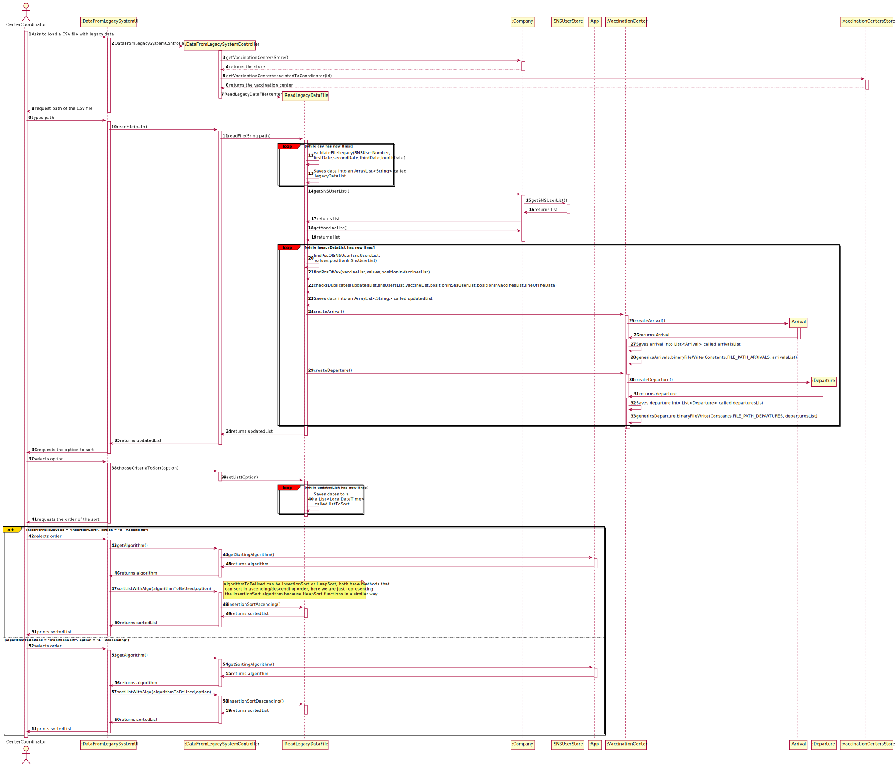
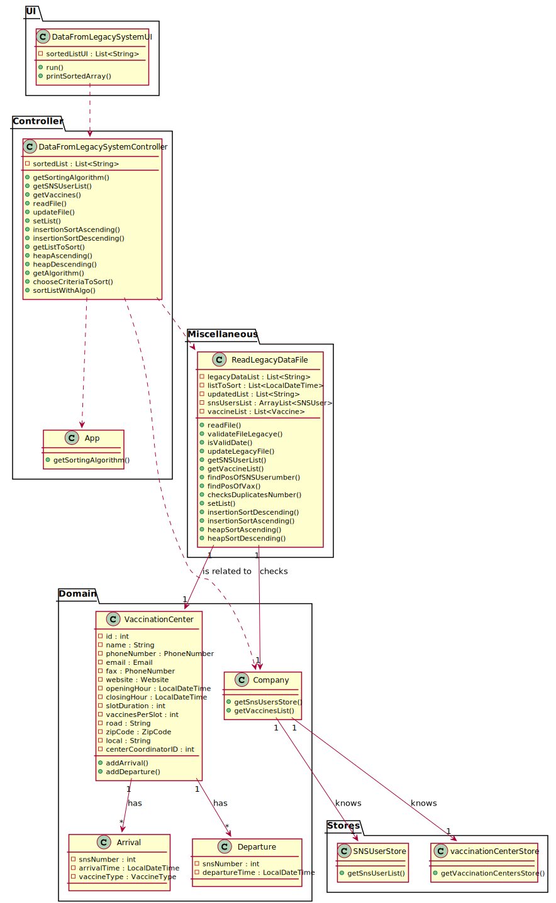

# US 015 - Check and export vaccination statistics

## 1. Requirements Engineering

### 1.1. User Story Description

As a **Center Coordinator**, I intend to **check** and **export** vaccination statistics.
I want to export, to a csv file, the total number of fully vaccinated users per day.

### 1.2. Customer Specifications and Clarifications

**From the specifications document:**

> The Center Coordinator wants to monitor the vaccination process, to see
statistics and charts, to evaluate the performance of the vaccination process, generate reports and
analyze data from other centers, including data from legacy systems.

**From the client clarifications:**

>*Question:* "in a meeting you already clarified that when uploading a file from a legacy system the application should check if the SNS Users are already registered and if not US 014 should be put to use. My question is now if only one or two SNS Users are not registered, should the whole legacy file be discarded?".
>
>*Answer:* SNS users that are not registered should be loaded/registered. The other SNS users should not be registered again and should be ignored.

>*Question:* "The file loaded in US17 have only one day to analyse or it could have more than one day(?) and in US16 we need to select the day to analyse from 8:00 to 20:00"
>
>*Answer:* The file can have data from more than one day. In US16 the center coordinator should select the day for which he wants to analyse the performance of the vaccination center.

>*Question:* "Regarding the validation of the data in the performance data csv, in case the dose is the not the first one, should we check if the user age and the date when the user took the other vaccine dose, are valid for the new dose to be administered? (This question popped up whith the project description: "The vaccine administration process comprises (i) one or more age groups (e.g.: 5 to 12 years old, 13 to 18 years old, greater than 18 years old), and (ii) per age group, the doses to be administered (e.g.: 1, 2, 3), the vaccine dosage (e.g.: 30 ml), and the time interval regarding the previously administered dose. Regarding this, it is important to notice that between doses (e.g.: between the 1st and 2nd doses) the dosage to be administered might vary as well as the time interval elapsing between two consecutive doses (e.g.: between the 1st and 2nd doses 21 days might be required, while between the 2nd and the 3 rd doses 6 months might be required).")"
>
>*Answer:* The data from the legacy system (CSV file) should be validated before being loaded.
Even so, each team should create a Spikevax vaccine that allows loading all vaccinations from the example CSV file that is available in moodle. This is required for developing MDISC tasks and assessment.

>*Question:* "You already have clarified that when uploading a file from a legacy system the application should check if the SNS Users are already registered and if not, we should register them using US 014. How exactly do you want this to proceed, in case there aren't registered users, should the application ask the center coordinator to select the file with the users data to be uploaded?"
>
>*Answer:*  US14 and US17 are two different features of the system. In US17, if the SNS user does not exist in the system, the vaccination of this SNS user should not be loaded. The system should continue processing the CSV file until all vaccinations are processed.

>*Question:* The file loaded in US17 have only one day to analyse or it could have more than one day(?) and in US16 we need to select the day to analyse from 8:00 to 20:00
>
>*Answer:* The file can have data from more than one day. In US16 the center coordinator should select the day for which he wants to analyse the performance of the vaccination center.

>*Question:* "Should the configuration file be defined , manually, before strating the program? Or Should an administrator or another DGS entity be able to alter the file in a user interface? This question is also important for US06 and US16 since these US also use configuration files, will the same process be applied to them?"
>
>*Answer:* The configuration file should be edited manually.

>*Question:* 1 - When sorting data by arrival time or central leaving time, should we sort from greater to smallest or from smallest to greater? 2 - Also, should we consider only time or date also? So, for example, if we sort from smaller to greater and consider a date also, 20/11/2020 11:00 would go before 20/12/2020 08:00. Without considering the date (only time) it would be 20/12/2020 08:00 before 20/11/2020 11:00.
>
>*Answer:* 1. The user must be able to sort in ascending and descending order. 2. Date and time should be used to sort the data. Sort the data by date and then by time.

>*Question:* "Should the vaccine named Spikevax, (the one in the given CSV file for US17), be registered before loading the CSV file?"
>
>*Answer:* Yes.

>*Question:* "You already have clarified that when uploading a file from a legacy system the application should check if the SNS Users are already registered and if not, we should register them using US 014. How exactly do you want this to proceed, in case there aren't registered users, should the application ask the center coordinator to select the file with the users data to be uploaded?"
>
>*Answer:* US14 and US17 are two different features of the system. In US17, if the SNS user does not exist in the system, the vaccination of this SNS user should not be loaded. The system should continue processing the CSV file until all vaccinations are processed.

>*Question:*  "In the Sprint D requirements is stated that two sorting algorithms should be implemented and that the imported data should be sorted by arrival time or center leaving time. Should each algorithm be capable of both sortings or is one of the algorithms supposed to do one (e.g. arrival time) and the other the remaining sorting criteria (e.g. leaving time)?"
>
>*Answer:* Each algorithm should be capable of doing both sortings. The application should be prepared to run both algorithms. The algorithm that will be used to sort data should be defined in a configuration file.

### 1.3. Acceptance Criteria

* **AC01:** Two sorting algorithms should be implemented
* **AC02:** The center coordinator must be able to choose the file that is to be uploaded
* **AC03:** Only files with valid information are accepted by the system.
* **AC04:** Duplicated information is ignored by the system.

### 1.4. Found out Dependencies

US017 has no dependencies.

### 1.5 Input and Output Data

**Input Data:**

* Selected data:
    - File Path
    - Option of the sort
    - Order of the sort

**Output Data:**

* Warning about the file validity/existence
* A sorted list
* (In)Success of the operation

### 1.6. System Sequence Diagram (SSD)

### 1.7 Other Relevant Remarks

* N/A

## 2. OO Analysis

### 2.1. Relevant Domain Model Excerpt

### 2.2. Other Remarks

No remarks.

## 3. Design - User Story Realization

### 3.1. Rationale

| Interaction ID | Question: Which class is responsible for... | Answer  | Justification (with patterns)  |
|:-------------  |:--------------------- |:------------|:---------------------------- |
| Step 1  | Asking to load a CSV file?	                                                                     |  LoadCSVUI         | **Pure Fabrication:** there is no reason to assign this responsibility to any existing class in the Domain Model.                                                                                                        |
| Step 2  |	Requesting the path of the CSV File?	                                                         |  LoadCSVUI         | **IE:** is responsible for user interactions                                                                                                                                                                             |
| Step 3  |	Typing the path of the CSV File?	                                                             |  LoadCSVUI         | **Pure Fabrication:** there is no reason to assign this responsibility to any existing class in the Domain Model.                                                                                                        |
| 		  |  ... validating the path?                                                                        |  LoadCSVUI         | **IE:** The UI knows the path, therefore it can validate it easily.                                                                                                                                                      | 
| 		  |  ... validating the CSV that has SNS User data?                                                  |  LoadCSVUI         | **IE:** The UI knows the data inside the CSV, so it can validate the entire file.                                                                                                                                        |
| 		  |  ... generating a password for the SNS User?                                                     |  Utils             | **Pure Fabrication:** This password generator was needed for US11, so in order to avoid code duplication we are assigning it to a shared class.                                                                          |
| 		  |  ... saving the data into an ArrayList?                                                          |  LoadCSVUI         | **IE:** The UI knows the CSV data so it can save that data on an ArrayList.                                                                                                                                              |
| 		  |  ... filling the SNSUserDTO with SNS User data?                                                  |  LoadCSVUI         | **IE:** The UI knows the data inside the ArrayList so it can fill the DTO with that data.                                                                                                                                |
| 		  |  ... transferring the SNS User data from the UI to the controller?	                             |  SNSUserDTO        | **DTO:** When there is so much data to transfer, it is better to opt by using a DTO in order to reduce coupling between UI and other classes.                                                                            |
| 		  |  ... transfer the SNS User data from the controller to the company?                              |  LoadCSVController | **Controller:** act as a mediator between the UI and the Model, in this case the Company class. Has the responsibility of controlling the data transmission between both. It maps the user action into model updates.    |
| 		  |  ... instantiating a new SNS User?	                                                             |  Company           | By applying the **Creator** pattern instances of Company have the initializing information for instances of SNSUser and pass it on creation.                                                                             |
| 		  |  ... validating the SNS User?                                                                    |  SNSUser           | **IE:** The SNS User class has it's own information so it can validate itself.                                                                                                                                           |
| 		  |  ... validating SNS User duplication? 	                                                         |  Company           | **IE:** The Company class knows all SNSUsers so it can check for duplicates.                                                                                                                                             | 
| 		  |  ... saving the SNS User?                                                                        |  Company           | **IE:** The Company class has all needed SNSUser information so it can save them.                                                                                                                                        |
| 		  |  ... registering the SNS User as a system user?                                                  |  AuthFacade        | **IE:** cf. A&A component documentation.                                                                                                                                                                                 |
| 		  |  ... checking duplicate email on all authenticated users?                                        |  AuthFacade        | **IE:** Knows all authenticated users email.                                                                                                                                                                             |
| Step 4  |	Informing about how many users were created, how many were saved and how many were duplicates?   |  LoadCSVUI         | **IE:** is responsible for user interactions.                                                                                                                                                                            |
| Step 5  |	Asking for a list with all saved SNS Users?					                                     |  LoadCSVUI         | **Pure Fabrication:** there is no reason to assign this responsibility to any existing class in the Domain Model.                                                                                                        |
| 		  |  ... who makes available the previous list to the LoadCSVUI?                                     |  LoadCSVController | **Controller:** act as a mediator between the UI and the Model. Has the responsibility of controlling the data transmission between both. It maps the user action into model updates.                                    |
| 		  |  ... who makes available  the previous list to the LoadCSVController?                            |  Company           | **IE:** The Company knows all saved SNS Users.                                                                                                                                                                           |
| Step 6  |	Showing the list?						                                                         |  LoadCSVUI         | **IE:** is responsible for user interactions.                                                                                                                                                                            |              

### Systematization ##

According to the taken rationale, the conceptual classes promoted to software classes are:

* Company
* SNSUser

Other software classes (i.e. Pure Fabrication) identified:

* LoadCSVUI
* Utils
* SNSUserDTO
* LoadCSVController

Other software classes of external systems/components:

* AuthFacade

## 3.2. Sequence Diagram (SD)

## 3.3. Class Diagram (CD)

